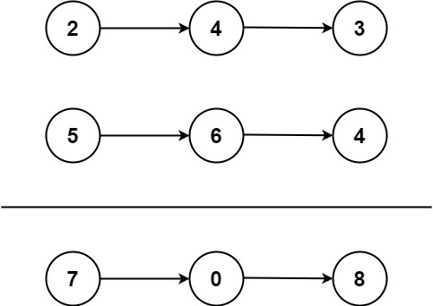

# 简单题
##  两数之和问题

题目描述：给定一个整数数组 nums 和一个整数目标值 target，请你在该数组中找出 和为目标值 target  的那 两个 整数，并返回它们的数组下标。

你可以假设每种输入只会对应一个答案。但是，数组中同一个元素在答案里不能重复出现。

你可以按任意顺序返回答案。

分析：
两数之和等价于一个数=target-另一数，问题转化为该数是否在数组中存在,所以代码可能包含对*是否存在某个数的判断与查询*
此外题目要求的是返回数组中两个数的下标，因此就牵涉到了*指标索引*的方法。


```python
# 如何查询是否存在：
print(2 in nums)
# 如何获取列表的指标
print(nums.index(2))
#查询某个元素出现的次数
print(nums.count(2))
#查询某个元素是否存在如果存在就返回指标 可以不用遍历，直接利用index方法，index参数可以为表达式
```


### 具体代码实现

```python
    def twoSum(self,nums, target):
        lens = len(nums)
        j=-1
        for i in range(1,lens):
            temp = nums[:i]    
        #在实际的比较中，由于一个for 所以跟前面或者后面比较就可以。考虑到这一点，如何比较？并不需要两个for循环，采用切片即可
            if (target - nums[i]) in temp:
                j = temp.index(target - nums[i])
                break
        return [j,i]


'''
更为经典的解法 哈希表（键值对）
首先是从数组到哈希表的映射，构建键值对，定义空字典={}，并装值。
首先需要明确 字典的键是根据hash值排序得到的，因此字典中是不存在重复的键，但是值允许重复。
因此键可以用编号，值就是数组的值。'''


def twoSum(self,nums,target):
    hashmap={}
    for ind,num in enumerate(nums):
        hashmap[num]=ind
        for i,num in enumerate(nums):
            j=hashmap.get(target-num)  #D.get()主要是针对字典中指定的键，返回它的对应的值，如果没有对应的键，则返回默认的值。
            if j is not None and i!=j:
                return [i,j]


class Solution:
    def twoSum(self, nums, target):
        """
        :type nums: List[int]
        :type target: int
        :rtype: List[int]
        """
        hashmap = {}
        for index, num in enumerate(nums):
            another_num = target - num
            if another_num in hashmap:
                return [hashmap[another_num], index]
            hashmap[num] = index
        return None
```


## 两数相加问题
题目描述：
给你两个 非空 的链表，表示两个非负的整数。它们每位数字都是按照 逆序 的方式存储的，并且每个节点只能存储 一位 数字。

请你将两个数相加，并以相同形式返回一个表示和的链表。

你可以假设除了数字 0 之外，这两个数都不会以 0 开头。




输入：l1 = [2,4,3], l2 = [5,6,4]
输出：[7,0,8]
解释：342 + 465 = 807.

提示：

每个链表中的节点数在范围 [1, 100] 内
0 <= Node.val <= 9
题目数据保证列表表示的数字不含前导零


分析：根据提示，链表最长为100，把结点的值都提出来之后相加，再装到链表里这种解法显然复杂度过高。显然都是逆序的，按位相加，再考虑进位，把各位相加的结果放到一个新链表中。该方法牵涉到*链表迭代*，*进位问题*（也就是说是否会产生进位，产生进位了怎么做）。

```python
# Definition for singly-linked list.
# class ListNode(object):
#     def __init__(self, val=0, next=None):
#         self.val = val
#         self.next = next
class Solution(object):
    def addTwoNumbers(self, l1, l2):
        """
        :type l1: ListNode
        :type l2: ListNode
        :rtype: ListNode
        """
        carry=0
        temp=cur=ListNode()
        while l1 or l2:       #while 和for循环不同，需要自己指定循环变量如何变化，所以在设计代码时，应该作为一对内容去进行考虑。
            if l1:
                x=l1.val
            else:
                x=0
            if l2:
                y=l2.val
            else:
                y=0
            sum=x+y+carry
            temp.next=ListNode(sum%10)
            temp=temp.next
            carry=sum//10
            if l1:l1=l1.next
            if l2:l2=l2.next
        if carry:temp.next=ListNode(carry)
        return cur.next
                 
```