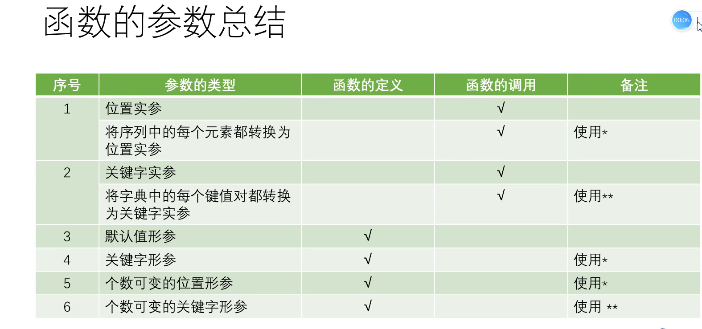
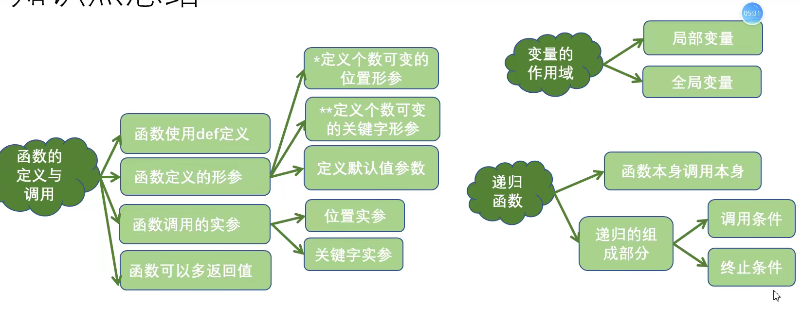

# 函数的调用&创建
## 函数的参数传递
def calc(a,b)  #a，b为形参
calc(10,20)  #10,20为实参
方式一：位置传输。按位置先后，a=10，b=20
方式二：关键字传参
```python
def calc(a,b):
result=calc(b=10,a=20)
#去找各自的关键字
```

不可变对象：整形，浮点数类型，在函数体内的修改不会影响实参的值。
如果是可变对象，则在函数体内的影响会影响实参。
## 函数的返回值
如果函数没有返回值，函数执行完之后不需要给调用处提供数据。
函数的返回值如果是1个，直接返回原类型，若是多个，则返回元组。有返回值要考虑接收问题。

## 函数的参数定义

函数定义默认值参数，给形参设置默认值，只有与默认值不符的时才需要传递实参。

个数可变的位置参数：定义函数时若无法确知传递的位置实参的个数，使用可变的位置参数。
使用*定义个数可变的位置形参。
结果为一个元组。

```python

#一个*输出以元组
fun(*arg)
print(arg)


def fun1(**arg):
    print(arg)
#对于个数可变的关键字形参，使用**做可变的关键字形参，输出结果为一个字典。
fun1(a=10)
fun1(a=10,b=30)
fun1(a=12,b=2,c=30)


#在一个函数的定义中，既有个数可变的关键字形参，也有个数可变的位置形参，要求个数可变的位置形参放在个数可变的关键字形参之前。

def fun2(*args1,**args2):
    pass
#下列程序为错误语法。   
def fun3(**arg1,*arg2):
    pass

```



```python
#函数定义内有a,b,c参数，在调用时需要三个位置参数，三个形参的关键字分别为a，b，c，在调用时可以通过关键字传递参数 
def fun(a,b,c):
    print('a=',a)
    print('b=',b)
    print('c=',c)

fun(10,20,30)  #括号内为函数调用时候的参数传递，称为位置传参。一个萝卜一个坑
lst=[11,22,33]
fun(lst)    #语句出错，lst指代一个位置参数。联系之前定义过的列表函数，直接传整个列表作为参数。
fun(*lst)   #因此利用*可将列表每个元素都转换为位置实参传入。
lst=[11,22,33，33]
fun(*lst)  #也会出错，*把列表的衣服脱了，结果有四个元素，超标了。


fun(a=100,c=22,b=300)  #第一步先进行关键字传参，先走一遍
dic={'a':12,'b':20,'c':20} 
fun(**dic)  #再利用字典，将字典扒衣服送到对应的参数当中去。


def fun4(a,b,*,c,d):  #该语句规定了*往后的参数只能采用关键字参数传递。
fun4(10,20,30,40)  #该语句报错，应用两个位置参数，而你传入了四个位置参数。
fun4(10,20,c=30,d=40)  #前两个参数采用的是位置实参传递 cd是关键字实参传递。

#函数定义时的形参顺序问题
def fun5(a,b,*c,d,**args):
    pass
def fun6(*args,**arg2):
    pass
def fun7(a,b=10,*args,**arg2):
    pass

```

## 变量的作用域
1. 程序代码能访问该变量的区域
2. 根据变量的有效范围可分为
   1. 局部变量：函数内定义并使用的变量，只在函数内部有效，局部变量使用global声明，这个变量就会变成全局变量。
   2. 全局变量 函数体以外的变量，可作用于函数内外。


## 递归函数

什么是递归函数
* 如果在一个函数的函数体内调用了该函数本身，这个函数就称为递归函数。

递归的组成部分
* 递归调用与递归终止条件

递归的调用过程
* 每递归一次函数，都会在栈内分配一个栈帧
* 每执行完一次函数，都会释放相应的空间

递归的优缺点
缺点：占用内存多，效率低下
优点：思路和代码简单

递归与回归

```python
#先递归，记账，fac（5）···fac（2）都赊着，等到fac（1）出来，就开始还账。1——2——3——4——5——6，最后输出。
def fun(n):
    if n==1:
        return 1
    else:
        res=n*fun(n-1)
        return res  
print(fun(6))


```



## 高阶函数

```python
#变量可以指向函数
f=abs
print(f(-10))
#传入函数，一个函数就可以接收另一个函数作为参数 
def add(x, y, f):
    return f(x) + f(y)
```


### map/reduce

map函数接收两个参数，一个是函数，还有一个是可迭代变量，map将传入的函数依次作用到序列的每个元素，并把结果作为新的Iterator返回。

```python
#把这个list所有数字转为字符串：
list(map(str, [1, 2, 3, 4, 5, 6, 7, 8, 9]))
```


reduce结果继续和序列的下一个元素做累积计算，

```python

reduce(f, [x1, x2, x3, x4]) = f(f(f(x1, x2), x3), x4)
#先map函数 将字符串转化成数字。 如何转化成10进制数，就10*（10*i+j）
reduce(fn, map(char2num, '13579'))

```

### filter函数

filter()也接收一个*函数*和一个*序列*。和map()不同的是，filter()把传入的函数依次作用于每个元素，然后*根据返回值是True还是False*决定保留还是丢弃该元素。
``` python
a=list(filter(not_empty,[1,2,3,4,5,6,7,8,9]))
# filter 函数返回的是一个迭代器，iterator，是一个惰性序列，强迫filter完成计算结果，需要用list（）获得所有结果并返回list   
list(iteration) 为内置函数，里面可以接收可迭代变量。
```


### sorted()函数
排序算法
sort 函数可以实现简单排序，比如给一个列表进行排序，
```python

sorted( iterable , * , key=None , reverse=False )  #key 是一个带参数的函数
s=[1,52,5,6,62,-24,51,85,852]
b=sorted(s,key=abs,reverse=True)
#字符串根据ASCII 码比较大小， 大写字母排在小写字母前面。忽略大小写，设置key。
b=sorted(['bob', 'about', 'Zoo', 'Credit'],key=str.lower)
print(b)
```

### 匿名函数
```python
#lambda x:表达式 x做变量，表达式运算。map函数传入两个参数。一个做函数，一个做参数。
list(map(lambda x:x*x,[1,2,3,4,5,6,7,8]))
#匿名函数有个限制，就是只能有一个表达式，不用写return，返回值就是该表达式的结果。
#用匿名函数有个好处，因为函数没有名字，不必担心函数名冲突。此外，匿名函数也是一个函数对象，也可以把匿名函数赋值给一个变量，再利用变量来调用该函数：
f=lambda x:x*x
c=f(5)
#也可以把匿名函数作为返回值返回，返回匿名函数   
```

### 装饰器
函数也是一个对象，函数也可以被赋值给变量，所以通过变量也可以调用该函数。
在代码运行期间，动态增加功能的方式称为装饰器（Decorator）
装饰器是一个返回函数的高阶函数。
*在不用更改原函数的代码前提下给函数增加新的功能。*

装饰器很明显的一个特征是在函数内定义函数，因此一旦函数被调用，那就意味着该函数体内的所有函数都将被调用。


### 偏函数 
作用：通过设定参数的默认值，降低函数调用的难度。
以int()函数为例，int(val,base=), base 决定了进制数(将非整型数视为一个几进制数)，默认为10，我们可以直接定义一个int2，int8函数。
```python
def int2(x,base=2):
    return  int(x,base)
int2('10001')
>>>17
#这个时候我们也可以采用偏函数语句，不需要额外定义。
#注意要导入functools包
import functools
functools.partial(int,base=2)
#functools.partial(func,/,*args,**keywords)
# int 为函数，传参为base=2。int 函数有base参数，默认为十进制。


```


